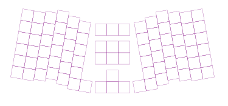
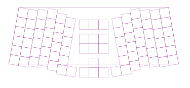
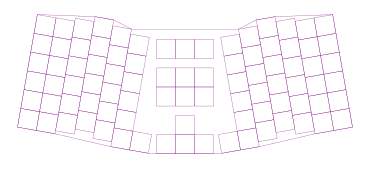
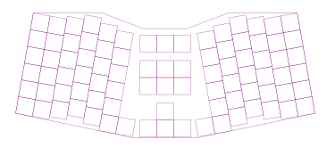

# Bloomer v4.0 Build Log

## 2020-07-05

### Recap

Having recently run into several issues while working on a different keyboard
design, the goals for the v4.0 Bloomer have somewhat changed and my motivation
to get it done has increased.

The new goals for the v4.0 design are:
- Use a layered acrylic case
    - v2.0 used stainless steel which I ended up not liking
    - v3.0 used a 3D printed case
    - Acrylic is cheap, easy to assemble, and has better acoustics
        - No worrying about shorting if electrical components touch the case
        - Also way more color options
    - Layers:
        - 3mm top layer
        - 4.5mm switch layer
        - 4.5mm middle layer
        - 3mm middle layer
        - 3mm bottom layer
- Remove on board RGB
    - Add a pin header to allow a strip to be used instead
    - Again, for build simplicity
    - WS2812b are notoriously annoying to work with
    - Also avoid needing capacitors which I never integrated on the v2.0/v3.0
- Reduce screw count
    - 8 spacers should be enough
- Use a daughter microcontroller board for build simplicity
    - Originally the v4.0 was going to have an oboard Atmega32u4 but to simplify
      the build process, it will instead use an MCU like the v2.0
    - Elite-C is probably the best choice (I already have 3 of them)
- Straighten the rows in center cluster
    - I think this looks a bit nicer
- Lower the USB port
    - This allows a right-angle usb cable to be used so the board fits a bit
      nicer when on top of a laptop

I already did a lot of work on the v4.0 but never documented it so this build
log is going to start part of the way through the process.

The tl;dr of what I've already accomplished is that I've finalized the exact
positions of each key switch on the board. This data is saved in:

- [switches.json](../data/switches.json)

I had made some progress on the PCB as well but I'll be starting that portion
over for a few reasons:
- I never drew up a schematic
- I discovered a better way to programmatically manipulate circuit boards
    - Using the scripting feature in KiCad
- I was planning on having an onboard MCU and no longer need that

### Finalizing the PCB Edge Cuts

Before I start designing the PCB, I want to finalize the exact points that
define the edge cuts (I.E. The perimeter). The reason for this is that the case
takes much longer to have manufactured than the PCB. In general, when ordering
laser cut acrylic from Ponoko, it takes around two weeks for it to be delivered
whereas PCBWay usually delivers circuit boards in as little as three days.

So, it makes more sense to design the case first and get that ordered and then
work on the PCB in the meantime.

#### Adding Scripts

To make calculating the PCB perimeter easier I'm going to use Python. The
scripts I wrote for the other keyboard project should come in handy; I'll just
need to make some small changes to them.

I've added the scripts directory to:
- [scripts/](../scripts)

This is a basic CLI with usage:
`./scripts/bloomer.py <command> [OPTIONS] <arguments>`

Each command is defined in its own file in the
[commands/](../scripts/commands)
directory.

To test that things are set up properly, I'm first going to render a basic SVG
of the switches using the `SwitchData` class. Rather than create a command for
this, I'll just use the `scratch` command since it's not something we'll need
to save.

The snippet is as follows:

```python
svg_writer = SvgWriter()
for switch in SwitchData().get_switches():
    poly = Polygon2D([
        Vector2D(switch['x'] - 9.525, switch['y'] - 9.525),
        Vector2D(switch['x'] + 9.525, switch['y'] - 9.525),
        Vector2D(switch['x'] + 9.525, switch['y'] + 9.525),
        Vector2D(switch['x'] - 9.525, switch['y'] + 9.525),
    ]).rotated_around(
        math.radians(switch['rotation']),
        Vector2D(switch['x'], switch['y']),
    )
    svg_writer.append_element(poly, SvgStyle(SVG_STYLE_POLY))
svg_writer.write_to_file("{}/temp/render.svg".format(bloomer_dir))
```

Result:


#### Calculating Perimeter

Now that we feel relatively confident in the Python scripts/classes, the plan
is to use them to calculate the perimeter. We'll need to adjust the
`SwitchData.get_corner()` method because it currently doesn't take rotation
into account.

We can effectively re-use the code from the snippet just above though:
- Create a polygon for the switch
- Rotate the polygon around itself
- Take one of the polygon's four points depending on which was requested

This isn't the most optimal way to calculate the corner's position but that
doesn't matter for our purposes:

```python
def get_corner(self, coord, corner):
    d = 9.525
    s = self.get_switch_by_coord(coord[0], coord[1])
    p = Polygon2D(
        [
            Vector2D(s["x"] - d, s["y"] - d),
            Vector2D(s["x"] + d, s["y"] - d),
            Vector2D(s["x"] + d, s["y"] + d),
            Vector2D(s["x"] - d, s["y"] + d),
        ]
    ).rotated_around(math.radians(s["rotation"]), Vector2D(s["x"], s["y"]))

    if corner == Corner.TOP_LEFT:
        return (round(p.vertices[0].x, 3), round(p.vertices[0].y, 3))
    elif corner == Corner.TOP_RIGHT:
        return (round(p.vertices[1].x, 3), round(p.vertices[1].y, 3))
    elif corner == Corner.BOTTOM_RIGHT:
        return (round(p.vertices[2].x, 3), round(p.vertices[2].y, 3))
    elif corner == Corner.BOTTOM_LEFT:
        return (round(p.vertices[3].x, 3), round(p.vertices[3].y, 3))
```

Testing it by making a simple 4 point polygon as follows:
```python
edge_vertices = [
    sd.get_corner((0, 0), Corner.TOP_LEFT),
    sd.get_corner((0, 14), Corner.TOP_RIGHT),
    sd.get_corner((5, 14), Corner.BOTTOM_RIGHT),
    sd.get_corner((5, 0), Corner.BOTTOM_LEFT),
]

perimeter = Polygon2D([ Vector2D(v[0], v[1]) for v in edge_vertices ])

# ...

svg_writer.append_element(perimeter, SvgStyle(SVG_STYLE_POLY))
```

Result:


With that done, coming up with the perimeter is easy. We just need to connect
the proper corners to make a reasonable outline:
```python
vertices = [
    sd.get_corner((0, 0), Corner.TOP_LEFT),
    sd.get_corner((0, 3), Corner.TOP_LEFT),
    sd.get_corner((0, 3), Corner.TOP_RIGHT),
    sd.get_corner((0, 4), Corner.TOP_RIGHT),
    sd.get_corner((0, 10), Corner.TOP_LEFT),
    sd.get_corner((0, 11), Corner.TOP_LEFT),
    sd.get_corner((0, 11), Corner.TOP_RIGHT),
    sd.get_corner((0, 14), Corner.TOP_RIGHT),
    sd.get_corner((5, 14), Corner.BOTTOM_RIGHT),
    sd.get_corner((5, 13), Corner.BOTTOM_LEFT),
    sd.get_corner((5, 9), Corner.BOTTOM_RIGHT),
    sd.get_corner((4, 8), Corner.BOTTOM_LEFT),
    sd.get_corner((5, 8), Corner.BOTTOM_RIGHT),
    sd.get_corner((5, 6), Corner.BOTTOM_LEFT),
    sd.get_corner((4, 6), Corner.BOTTOM_RIGHT),
    sd.get_corner((5, 5), Corner.BOTTOM_LEFT),
    sd.get_corner((5, 1), Corner.BOTTOM_RIGHT),
    sd.get_corner((5, 0), Corner.BOTTOM_LEFT),
]
```

Result:


I purposefully left some space between the top row of keys in the center
cluster and the top edge of the PCB. The reason is that the Elite-C has to sit
flush with the top of the PCB and the bottom pins can't overlap the second row
of switches.

After a bit of tinkering, I simplified the perimeter to the following:


Even though I liked how the edges perfectly followed the edges of the switches
before, this will actually be better when it comes to generating the case. All
I will need to do is take the path and expand it.

The raw data is saved in:
- [pcb_edge_vertices.json](../data/pcb_edge_vertices.json)


